#Project1 说明文档
####姓名：罗宇琦
####学号：18307130255
##一、Github地址&Github Pages地址

##二、项目完成情况
本次项目涉及HTML、CSS及少数JS，本人bonus之外功能性要求全部完成。bunus除响应式布局实现可能不够全面之外基本完成。以下是各页面的截图（展示的是chrome上效果，firefox外观差不多，除了input框的默认表现不太一样，但不影响整体感官）
###主页

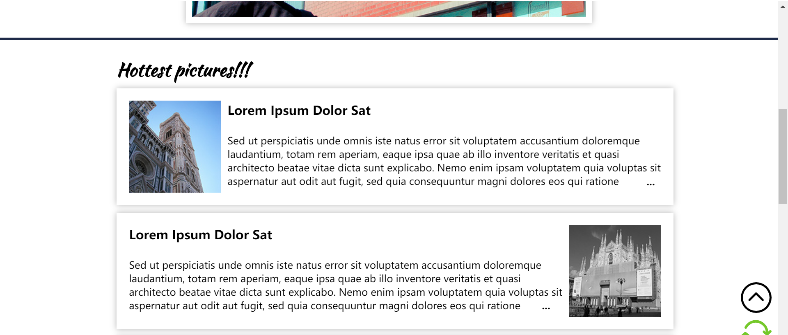
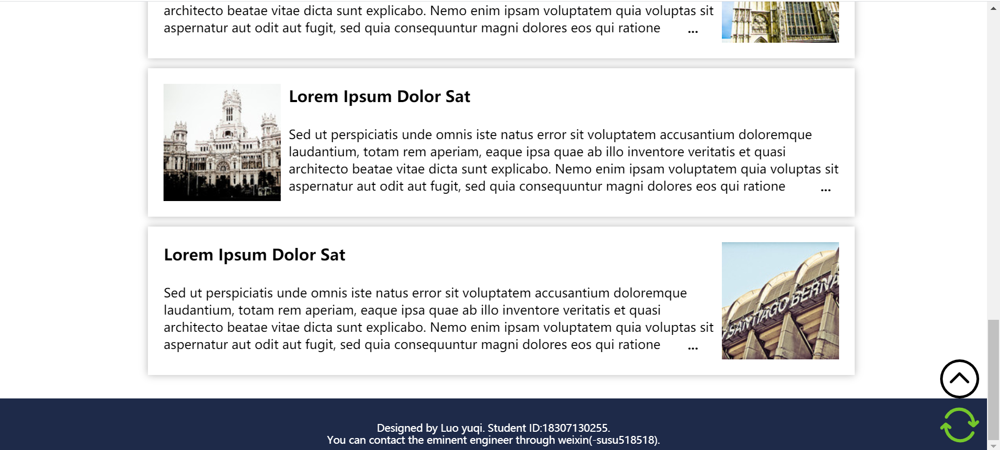
###浏览页
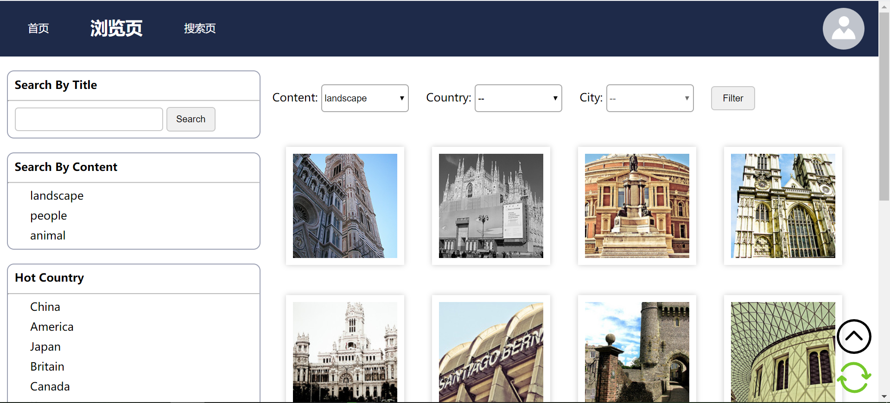
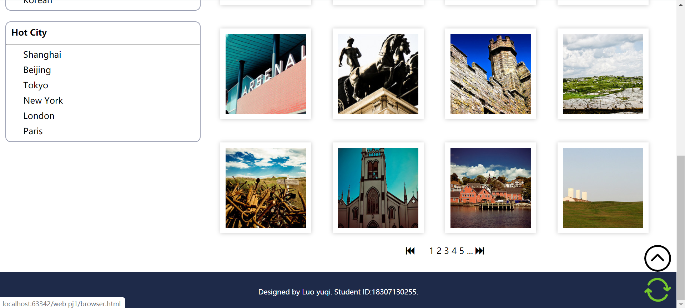
###搜索页
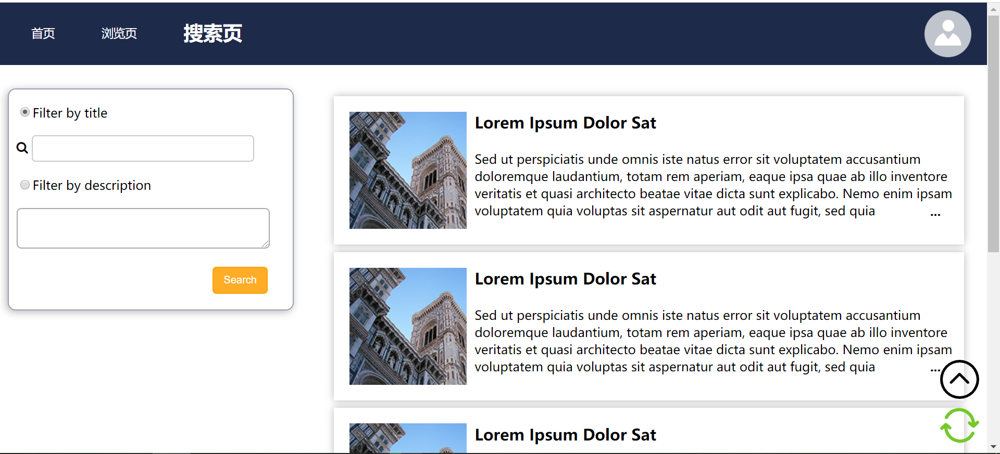

###上传
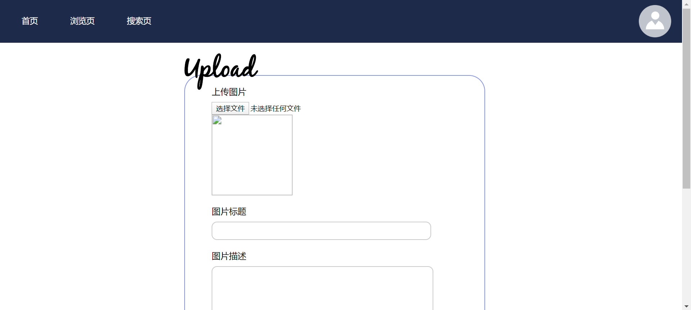
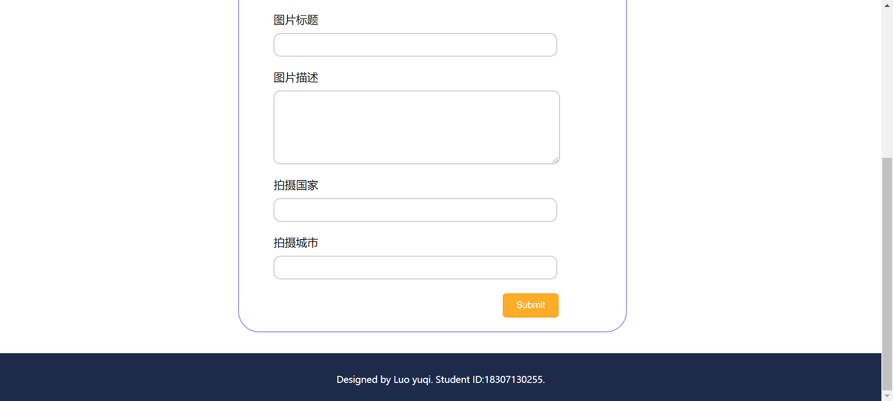
###我的照片
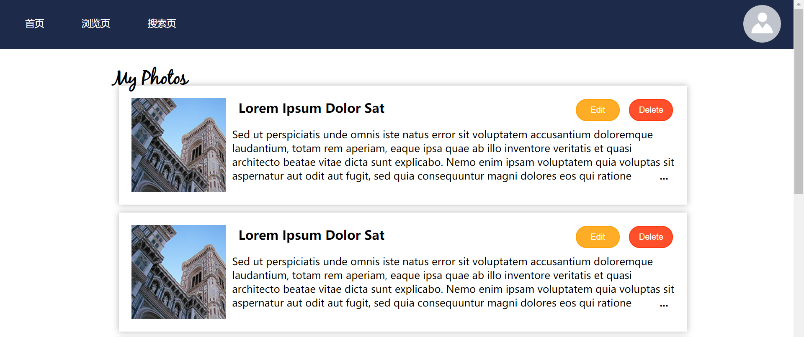
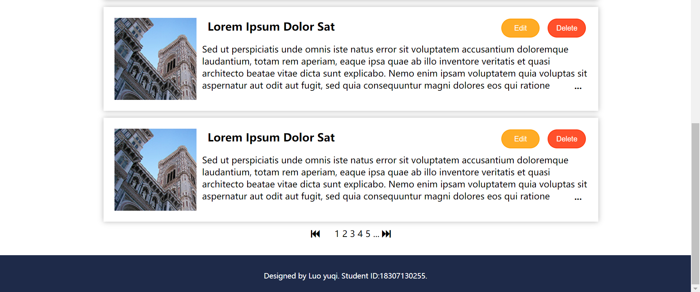
###我的收藏
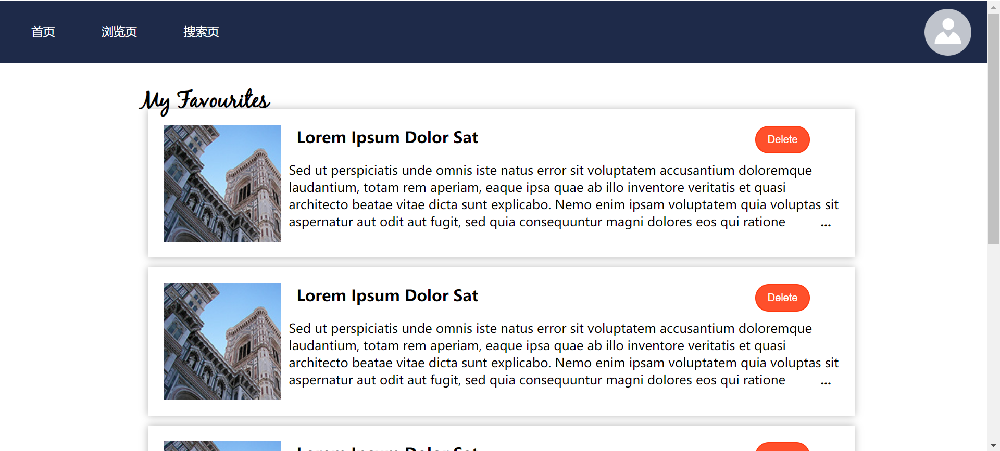
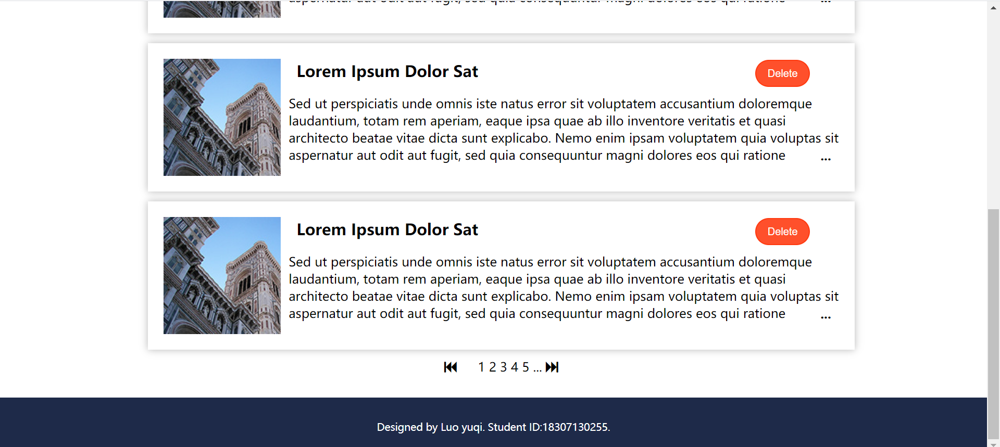
###登录界面
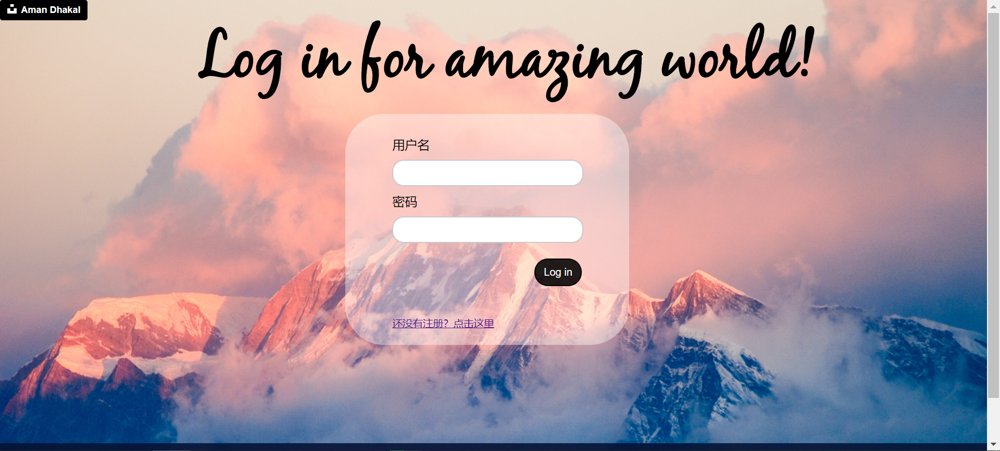
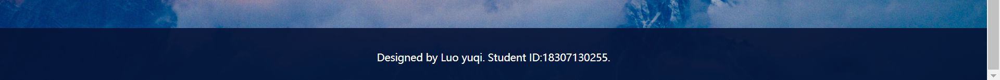
###注册界面
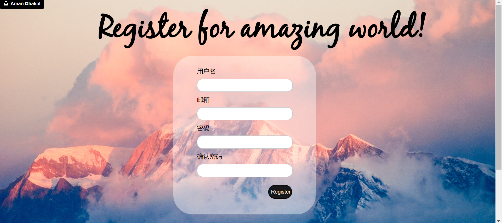
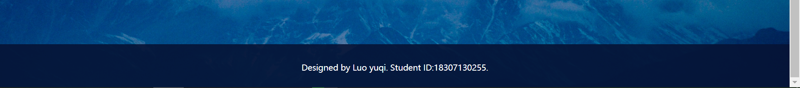
###照片详情
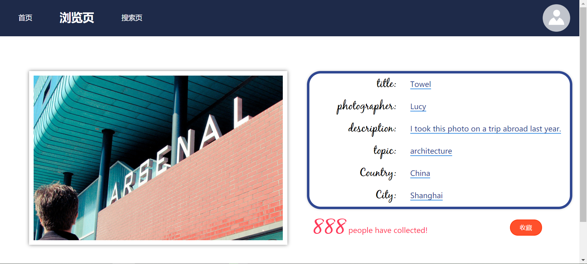

##三、bonus完成情况和解决方法
###1、图片剪裁
我通过用div作为承载图片的容器，将图片作为div的背景，通过控制div大小实现剪裁效果。并使用css使照片尽量展示中间主体部分。在browser中我使用js展示16张照片也运用了这种方式。理论上来说，我所有的照片都使用的是normal文件夹中的照片（除非我漏改了orz，应该没有）
###2、响应式布局
响应式布局我主要控制的是宽度方面的响应式，因为高度目前我不知道是否能够有效控制。主要是在涉及页面宽度和margin-left、margin-right的大小用百分比控制，这样适度地缩放页面宽度，页面各组件的相对位置不会有太大变化。在index和register页面我使用了min-with因为当页面缩小幅度过大会使背景图高度不够，无论是否repeat都十分丑陋。
###3、界面美观
布局主要是依据示例微调了一些，界面风格以简洁大方为主，色调是蓝黄对比色，引入了blackjack字体来装饰标题。

##四、对本课程的建议
我觉得lab与pj内容多有重复，反复重复类似操作。lab要是能让我们学习一个小而有趣的知识点可能对pj会更有帮助。比如上次bootstrap学习运用轮播图就比较有趣。（但球球不要像软件工程这门课一样过头orz）
